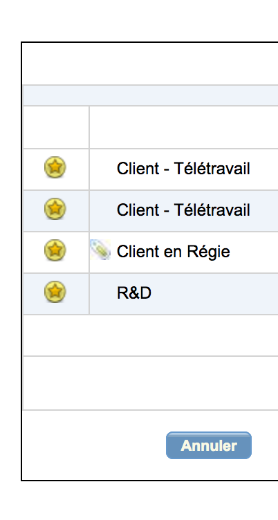

# YodaBotKelio

Yoda Hangouts Bot For Kelio CRA
You can set one by one client percentage

# Config

- Rename config.model.js -> config.js
- Replace your Kelio / Hangouts account in the config.js file
- "to" paramater is somethink like (ddsqdkqsd4567DKLS@public.talk.google.com)
- Send message to your bot to see him.
- Select yours clients as favorite on Kelio to save the list (see preview 2)
- May the force be with you !
- Enjoy !

# AutoLoad

## MAC OSX

## Windows

## Linux

# Chat Option

exit -> Stop the process

# Preview

